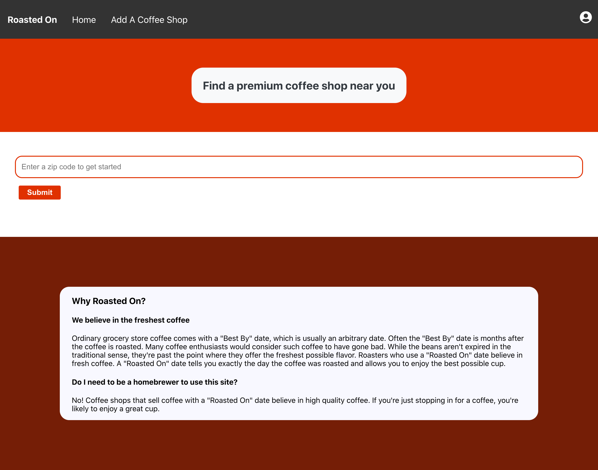
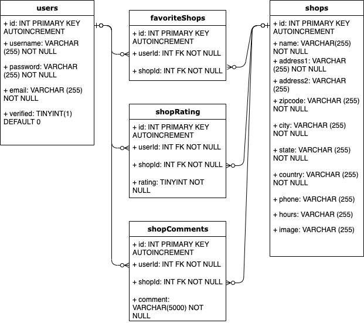
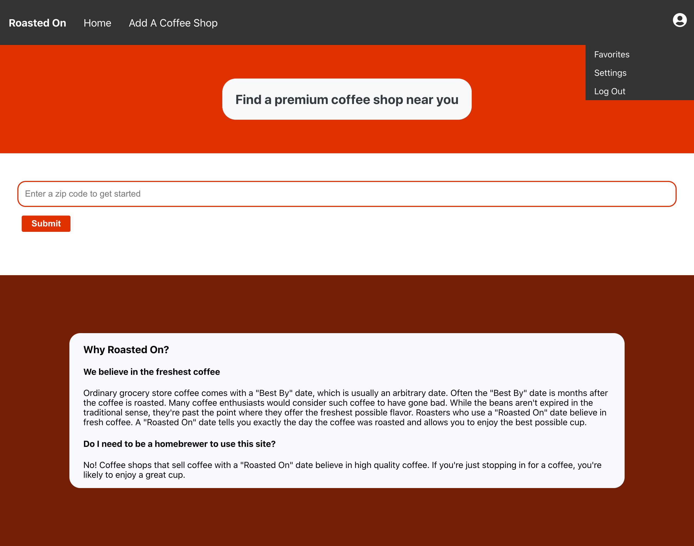
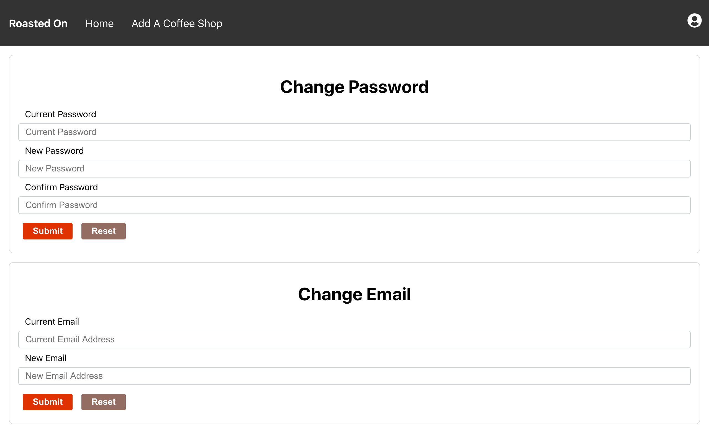
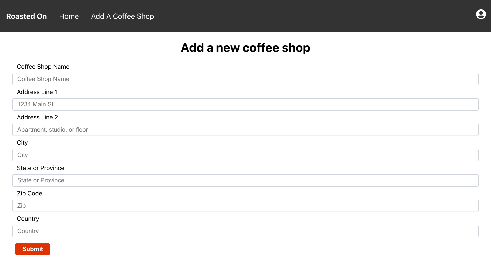
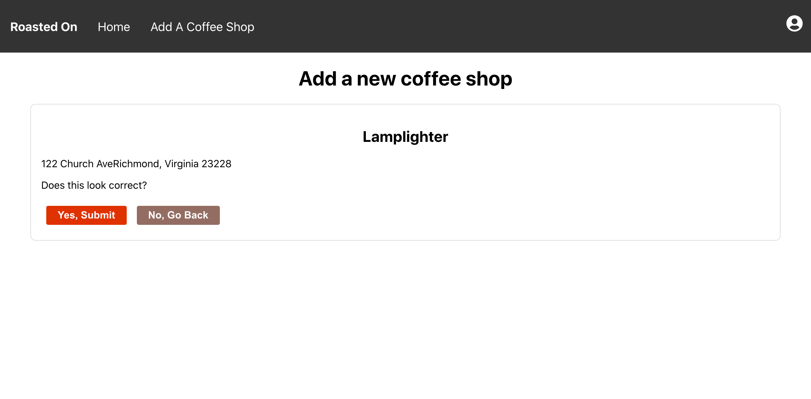
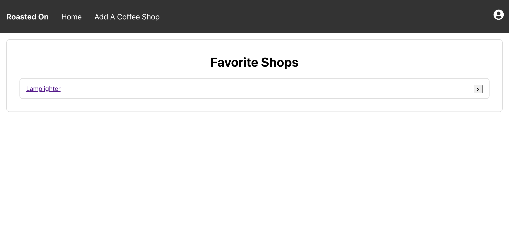
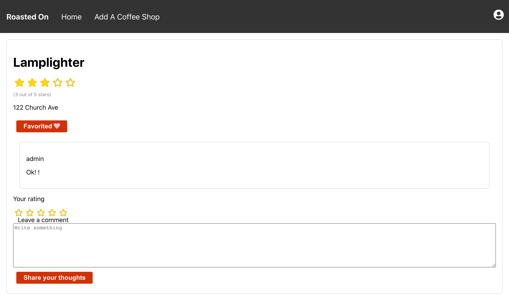
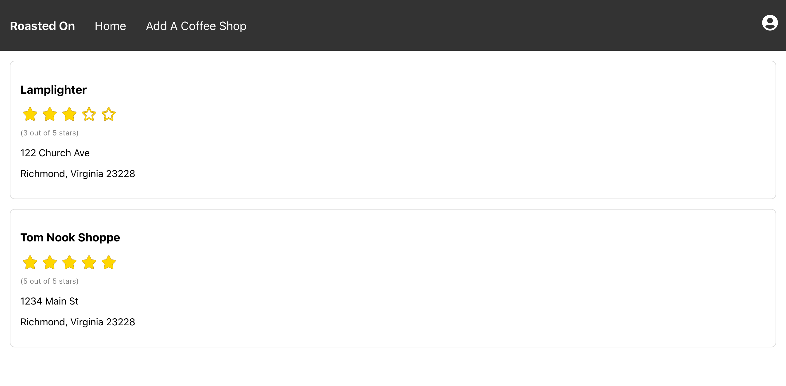

# RoastedOn
Roasted On is a Yelp-like coffee resource for finding and recommending coffee shops.

The database was designed using an entity-relationship diagram.

As can be seen in the above diagram, many:many relationships exist and are implemented with the below tables:

## Many:Many Relationships:
- favoriteShops
- shopRating
- shopComments

The project was built with Node.js, Express, MySQL, React, Redux, styled components, and other packages. While the page is no longer being hosted, below are screenshots of how the project was implemented:

## Home Page:

## Home Page With Menu:

## Settings:

## Add New Shop:

## Confirmation:

## Favorites Page:

## Shop View:

## Shop Search:

